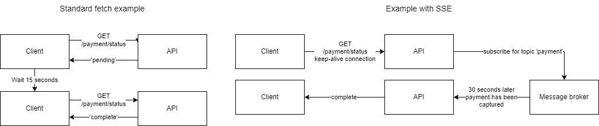

Server-Side Events are a great way to achieve Realtime functionality on your site. As we will be utilizing the EventSource interface that is natively supported in the browser you won't have to deal with setting up a Socket connection on your site.

The example I am going to show later in the article is based on the following setup:

- React Client that will open a connection with the backend.
  - Handle the events from the EventSource and react to the event.
- Node.js Express backend with an endpoint that requires an open connection and will write streams of data back to the client in the form of a simple counter.

To understand the SSE and how we would usually do this in an application before SSE / Event Driven architecture - Let's have a look at a visual example of fetching a user's payment status. In the left side of the screenshot, you can see we send a GET request fetching the payment status. We instantly receive a "pending" status as the payment hasn't gone through yet. Our frontend will have some kind of long polling feature that refetches this. At some point, we get the desired data (error / complete) and we can change the frontend accordingly. The example on the right side will show an example using the concept of Event Driven / SSE. As you can see we open a connection to the backend with our GET request. At some point, we get streams of data containing the complete / error data we are expecting. This means we show the payment status in real-time and only open 1 connection to the backend. 

 


In this article tho I am not showing the above example but a more straightforward implementation of SSE. The concept is the same, but the feature is not. You can check out the whole code used in this article here: [Github](https://github.com/ALagoni97/blog-projects/tree/main/event-source-article)

### Drawbacks:
There isn't a whole lot to consider in terms of the drawbacks of using EventSource. It will require some knowledge of using it and setting it up correctly, but you can achieve some pretty huge UX benefits instead of long polling for data (Which can still be fine to use). 

**One-way communication:**
The drawback of using the EventSource standard is the limitations of SSE. It is a one-way communication between the client and the server, so the client can send events back. If this is a requirement then WebSockets is the way to go. Usually, if you think about it, then the most common Event Driven features only require one-way communication anyway.
Examples such as:

- Receive a new notification such as a new message, updates on status, etc.
- Update a feed with new data
- Update a payment status when it's being processed

**HTTP/2 Recommendation:**
If your website is being served over HTTP 1 then there is a drawback here to be noted. You will only be able to have 6 open connections per browser with an open connection. In HTTP 2 this limit is set to 100. In the event of too many open connections, the next connection will just terminate without being opened. So if a lot of your users are still being served through HTTP 1 then it's a good idea to not have anything business-critical stuff in the EventSource features.

### Implementation in a Node.js Backend
Implementing the backend is relatively simple, there are a few things we need to understand.

The response back to the client MUST have these headers:
`Cache-Control: 'no-cache'` - So the client won't cache the result
`Content-Type: 'text/event-stream'` - Set to indicate that the client is waiting for streams of data. 
`Connection: 'keep-alive' ` - Indicates a persistent connection with the client.

#### SSE newline:
When you send data back to the client it is important to tell the client what to expect from the response. We do this by separating our response by newlines in our stream of data. This is so we can send multiple types of data to the client without the client stopping the stream of data and using it just yet. A quick example of this could be you want to send multiple streams of data to the client without finishing it until everything is sent. 

**Single newline \n:** Used to separate different fields within a single event. For example, event type (event:), data (data:), id (id:), and retry (retry:) can be separated by single newlines within an event.

**Double newline \n\n:** Used to indicate the end of a single server-sent event. After the server sends a double newline, the client knows that the current event has been fully received and can start processing it. The server can start sending a new event at this point.

An example of utilizing this could be the payment status given earlier:
`res.write('event: PaymentStatus \n')`
`res.write('data: JSON.stringify({error: null, data: 'PaymentCaptured'}) \n\n')`
It will wait until the data stream has been sent since we added the double newline in the response. 

#### Simple code example:
So I am gonna make a very basic example that will work and you should be able to expand upon that example or take the foundation and implement it in your backend. The important notes and things to remember are already written above, so go check it out. Anyway here's the code:

```Typescript
app.get("/event-source", (req, res) => {
  res.setHeader("Cache-Control", "no-store");
  res.setHeader("Content-Type", "text/event-stream");
  res.setHeader("Connection", "keep-alive");
  res.flushHeaders();

  /*
  Store business logic here - Fetch from external sources (Message broker)
  */
  let counter = 0;
  let interval = setInterval(() => {
    counter++;
    if (counter > 10) {
      clearInterval(interval);
      res.end();
    }
    // res.write(`event: interval\n`);
    res.write(`id: interval${counter} \n`);
    res.write(`data: ${JSON.stringify({ num: counter })}\n\n`);
  }, 1000);

  res.on("close", () => {
    clearInterval(interval);

    res.end();
  });
});

app.listen(port, () => {
  console.log(`Example app listening at http://localhost:${port}`);
});
```

I have commented on a specific line which is:

```Typescript
res.write(`event: interval\n`);
```

If you use this syntax remember to look at the ["Listening for custom events"](#listening-for-custom-events) section below as this will require something else in the client as it's no longer a standard "message" being sent back but an event with data. I recommend doing this as it will be more readable and maintainable in the future. It will also make it possible for you to have 1 endpoint with multiple events.

This is obviously where you need to store the actual business logic and you fetch whatever data you need. Let's say you want a real-time chat app, then this endpoint would listen to events in a PubSub queue (as an example) and if the user that is currently subscribing to that chat message is the id of the recipient of the message, then we show the newly added message. This can be expanded upon endlessly to fit whatever requirements that are present for you.

### Implementation on the frontend (React):

As EventSource is supported out of the box and won't require anything specifically on the client I have tried not showing too much React-specific code. It's important to note that EventSource must be instantiated in the client and not on the server, so if you are using some kind of server-side framework such as Next / Nuxt then remember to encapsulate the EventSource logic in the client. In my example, you will see me wrap it in useEffect to make sure the EventSource is available.

#### Listening for messages:

Messages are server-side events sent without an 'event:' payload. That qualifies as a message and can be listened to in this way:

``` JSX
const [data, setData] = useState<{ num: number } | null>();
useEffect(() => {
    const evtSource = new EventSource("http://localhost:4000/event-source");
    evtSource.onmessage = (event) => {
      if (event.data) {
        setData(JSON.parse(event.data));
      }
    };
}, []);
```

#### Listening for custom events:

When you send server-side events with an 'event:' payload we need to listen to the event in another way:

```JSX
evtSource.addEventListener("interval", (event) => {
  if (event.data) {
    setData(JSON.parse(event.data));
  }
});
```

You can display it like so:

``` JSX
{data && (
  <div>
    <p>Counter: {data.num}</p>
  </div>
)}
```

That's it. You now understand what the syntax is for sending SSE and how to implement it in React. This can easily be transferred to other frameworks as everything is supported out of the gate. I hope you got something out of the article and at least learned a thing or two about SSE.